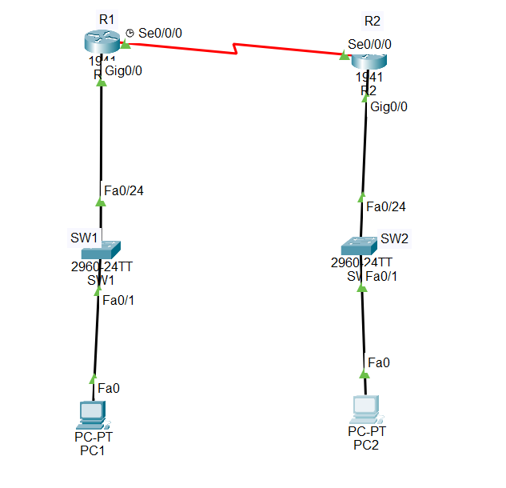

# Enterprise WAN & Static Routing Lab

## Objective

Designed and configured a two-site WAN using Cisco Packet Tracer, connecting two separate LANs through a serial WAN link and implementing static routing between the sites.

## Network Components

- 2 Cisco 1941 routers
- 2 Cisco 2960 switches
- 2 PCs
- Serial DCE/DTE WAN connection

## Networking Concepts Demonstrated

- IPv4 addressing
- WAN connectivity
- Serial DCE/DTE
- Static routing
- Default gateways
- Router-to-router communication
- LAN-to-LAN communication
- Cisco IOS configuration
- Network connectivity testing

## Network Topology

## IP Addressing

### Site A LAN

- **Network:** `192.168.70.0/24`
- **R1 G0/0:** `192.168.70.1`
- **PC1:** `192.168.70.10`
- **Default Gateway:** `192.168.70.1`

### WAN

- **Network:** `10.0.0.0/30`
- **R1 S0/0/0:** `10.0.0.1`
- **R2 S0/0/0:** `10.0.0.2`

### Site B LAN

- **Network:** `192.168.80.0/24`
- **R2 G0/0:** `192.168.80.1`
- **PC2:** `192.168.80.10`
- **Default Gateway:** `192.168.80.1`

## Router Configuration

### R1

R1 was configured with a LAN interface, serial WAN interface, and a static route to the Site B network.

    interface gigabitEthernet 0/0
     ip address 192.168.70.1 255.255.255.0
     no shutdown

    interface serial 0/0/0
     ip address 10.0.0.1 255.255.255.252
     clock rate 64000
     no shutdown

    ip route 192.168.80.0 255.255.255.0 10.0.0.2

### R2

R2 was configured with a LAN interface, serial WAN interface, and a static route to the Site A network.

    interface gigabitEthernet 0/0
     ip address 192.168.80.1 255.255.255.0
     no shutdown

    interface serial 0/0/0
     ip address 10.0.0.2 255.255.255.252
     no shutdown

    ip route 192.168.70.0 255.255.255.0 10.0.0.1

## Static Routing

Static routes were configured on both routers to allow communication between the two LANs.

### R1 Route

    ip route 192.168.80.0 255.255.255.0 10.0.0.2

### R2 Route

    ip route 192.168.70.0 255.255.255.0 10.0.0.1

## WAN Configuration

The routers were connected using a serial DCE/DTE connection.

R1 was configured as the DCE side and provided the clock rate:

    clock rate 64000

The WAN network uses the `10.0.0.0/30` subnet.

## Connectivity Tests

The following tests were successfully completed:

- **R1 → R2 WAN (`10.0.0.2`):** Successful
- **PC1 → PC2 (`192.168.80.10`):** Successful
- **PC2 → PC1 (`192.168.70.10`):** Successful
- **Inter-site communication:** Successful

## Verification Commands

The following Cisco IOS commands were used to verify the configuration:

    show ip interface brief
    show ip route
    ping 10.0.0.2

Static routes appeared in the routing tables of both routers.

## Technologies Used

- Cisco Packet Tracer
- Cisco IOS
- Cisco 1941 Router
- Cisco 2960 Switch
- Serial WAN
- Static Routing
- IPv4
- Ethernet
- DCE/DTE

## Project Files

- `enterprise-wan-static-routing-lab.pkt` — Cisco Packet Tracer project
- `topology.png` — Network topology screenshot
- `README.md` — Project documentation

## Conclusion

This project demonstrates how two separate LANs can be connected through a serial WAN using Cisco routers and static routing.

The network was successfully tested for WAN connectivity, routing between the two sites, and end-to-end communication between PC1 and PC2.